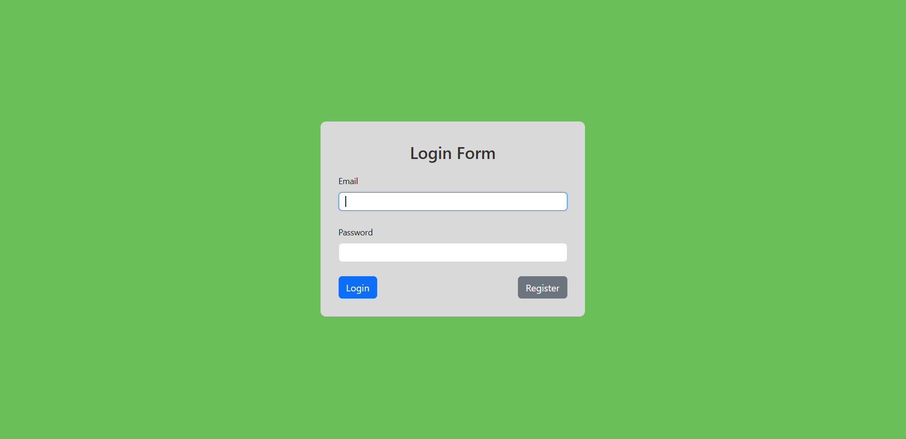
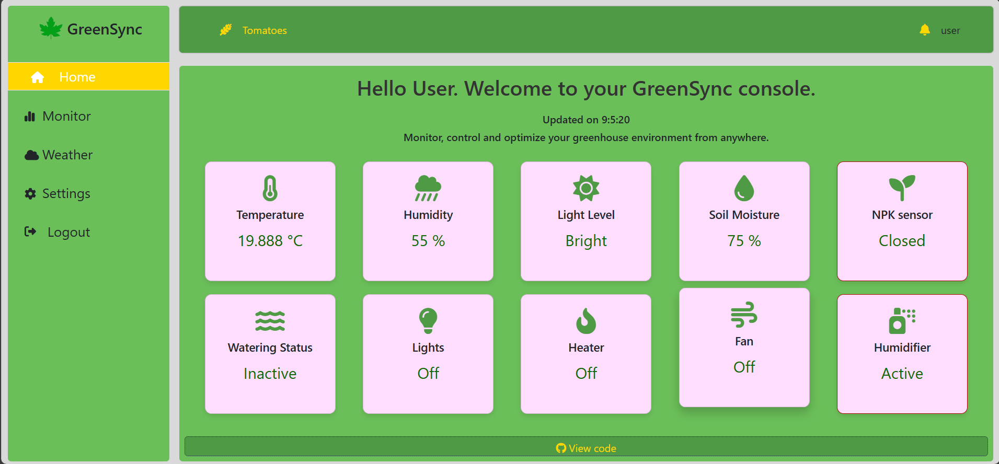
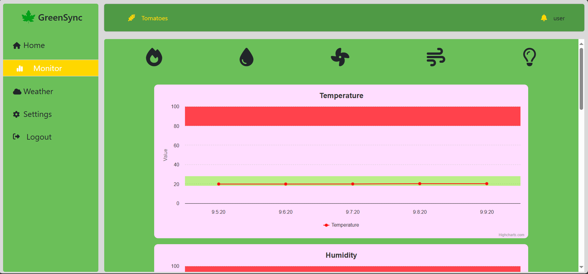
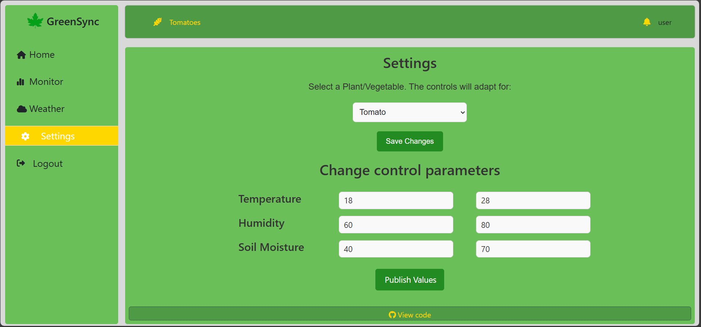

# GreenHouse

A repository to hold the greenhouse web app for major project.

## ⚙️ Requirements

- Node.js (v16 or above)
- MongoDB (local or Atlas)
- AWS account (IoT Core, IAM)
- ESP32 + DHT11 + Soil Moisture + LDR sensors
- Arduino IDE or PlatformIO
- Git

---

## 🚀 Installation Guide

### 1. Clone the Repository

```bash
git clone https://github.com/Aavash1738/GreenHouse.git
cd GreenHouse
```

### 2. Backend Setup

```bash
cd backend
npm install
```

Create a .env file in the backend/ folder with the following content

```bash
PORT=5000
MONGO_URI=your_mongodb_connection_string
AWS_ACCESS_KEY_ID=your_aws_access_key
AWS_SECRET_ACCESS_KEY=your_aws_secret
IOT_ENDPOINT=your_aws_iot_endpoint
```

### 3. Frontend Setup

In a new terminal:

```bash
cd client
npm install
```

Create an .evn file inside this folder witht the following content:

```bash
CHOKIDAR_USEPOLLING=false
CHOKIDAR_IGNORE=node_modules,build
REACT_APP_AWS_ACCESS_KEY_ID=***
REACT_APP_AWS_SECRET_ACCESS_KEY=***
REACT_APP_AWS_REGION=***
REACT_APP_AWS_IOT_ENDPOINT=***
REACT_APP_MY_SECRET=***
```

You can now run the development server using

```bash
npm run dev
```

### 4. ESP32 Setup

Navigate to ESP32_final/ folder, and open the file on Aduino IDE.

Make necessary changes, such as configurting your IoT endpoint, Wi-Fi credentials and then upload to the ESP32 device.

Register your ESP32 as a device on IoT Core to get access to specific certificates.

### 5. Check the interface on your browser.

```bash
http://localhost:3000/
OR
http://localhost:8080/
```

---

## User Interface

### Login/Register Page

The user first registers themselves, which sets up their architecture for them. After this, they have to manually register their ESP as a thing. Completing this will deem the system functional.



### Home Page

After registering, the user can log in to their web console. The user is welcomed to their home page, which provides a brief description of their plant care status.



### Monitor Page

The user can also choose to view real time data instead, which is available in the "Monitor" page.



### Settings Page

Finally, the user can choose to override automated settings to manually trigger lights, pumps, or ventilation.



As a precaution, we have implemented a timer to turn off the motor after 10 seconds of operation to prevent overflow. This value can be altered to best fit the user.

---
